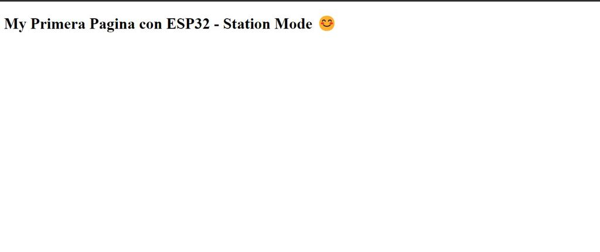
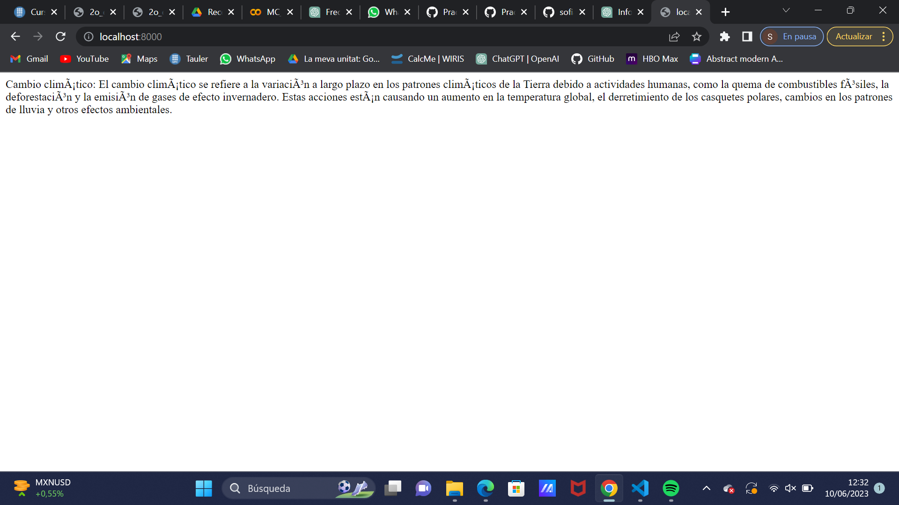

# INFORME PRACTICA 3a
 ## CODI
 ```cpp

#include <Arduino.h>
#include <WiFi.h>
#include <WebServer.h>

// SSID & Password
const char* ssid = "eel-lab029-02 0350";  // Enter your SSID here
const char* password = "9-517J5k"; 
 //Enter your Password here

WebServer server(80);  // Object of WebServer(HTTP port, 80 is defult)

void handle_root();

void setup() {
 Serial.begin(115200);
 Serial.println("Try Connecting to ");
 Serial.println(ssid);

 // Connect to your wi-fi modem
 WiFi.begin(ssid, password);

 // Check wi-fi is connected to wi-fi network
 while (WiFi.status() != WL_CONNECTED) {
 delay(1000);
 Serial.print(".");
 }
 Serial.println("");
 Serial.println("WiFi connected successfully");
 Serial.print("Got IP: ");
 Serial.println(WiFi.localIP());  //Show ESP32 IP on serial

 server.on("/", handle_root);

 server.begin();
 Serial.println("HTTP server started");
 delay(100); 
}

void loop() {
 server.handleClient();
}

// HTML & CSS contents which display on web server
String HTML = "<!DOCTYPE html>\
<html>\
<body>\
<h1>My Primera Pagina con ESP32 - Station Mode &#128522;</h1>\
</body>\
</html>";

// Handle root url (/)
void handle_root() {
 server.send(200, "text/html", HTML);
}

 ```

 ## FUNCIONAMENT

 En les primeres linees de codi abans del setup és on deifinim la xarxa on ens volem connectar i la contrassenya d'aquesta.

En el setup ens mostra la xarxa a la qual ens estem conectant i si esta conectada correctament, si és aixi ens sortirà per la terminal "WiFi connected successfully" i acontinuació la IP del servidor. En l'última part del setup estem enviant aquest servidor a la pàgina web amb la funció handle_root que definim en les últimes linees del codi.

El loop l'única funció que té en aquest codi és mantenir el sevidor.

```cpp 
String HTML = "<!DOCTYPE html>\
<html>\
<body>\
<h1>My Primera Pagina con ESP32 - Station Mode &#128522;</h1>\
</body>\
</html>";
```

Aquestes sentencies descriuen el contingut de la pagina web HTML amb DOCTYPE html guardat al string i la capcelera.

Finalment hem declarat la funció que envia la informació a la web, com he especificat abans, utilitzant el string HTML ja declarat.

El resultat és: 



Aquest és el resultat de modificar la pàgina html incluint un text amb informació del canvi climàtic amb l'editor markdown.

